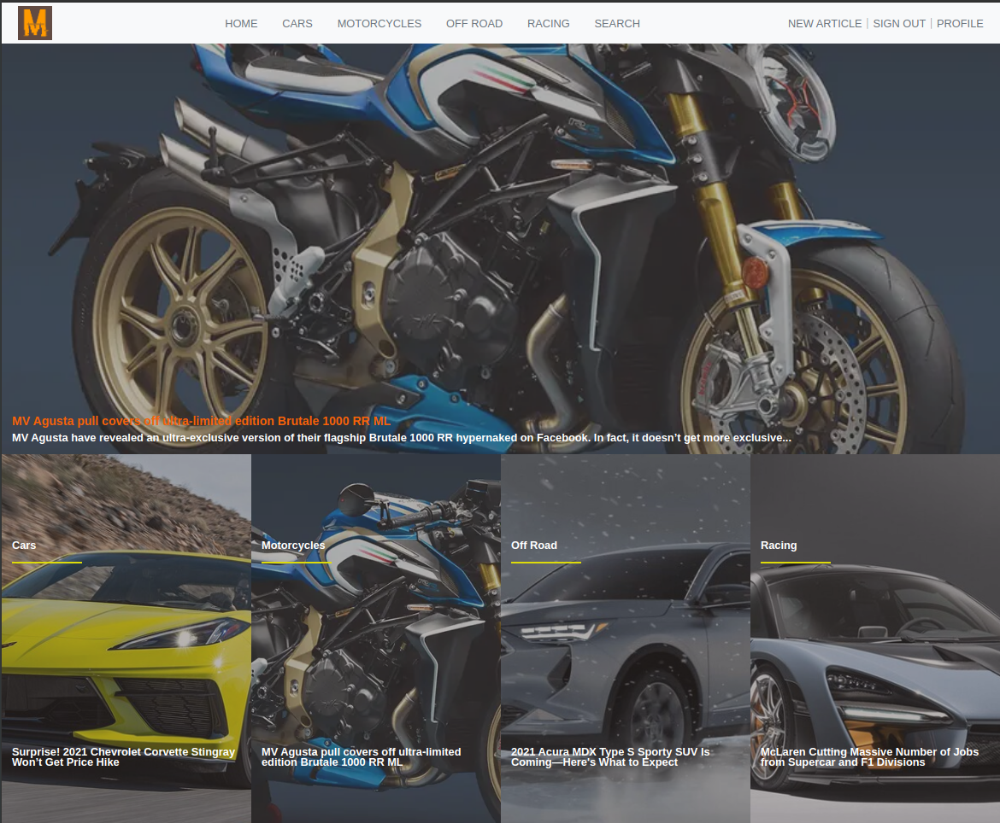
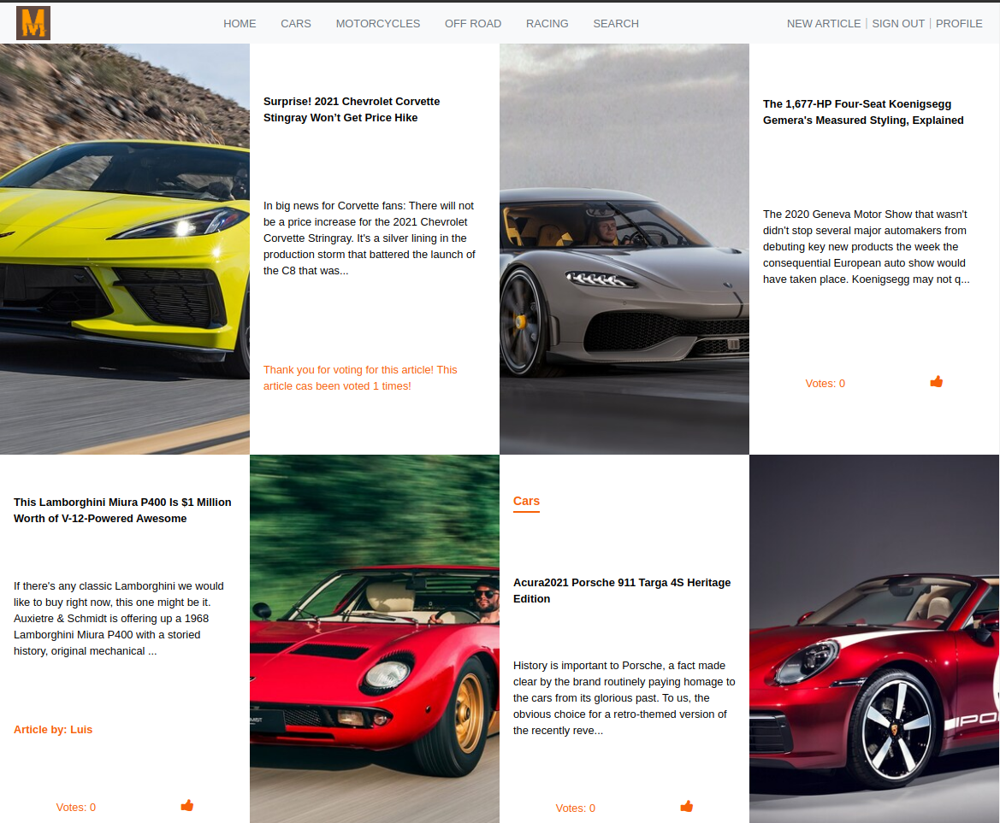
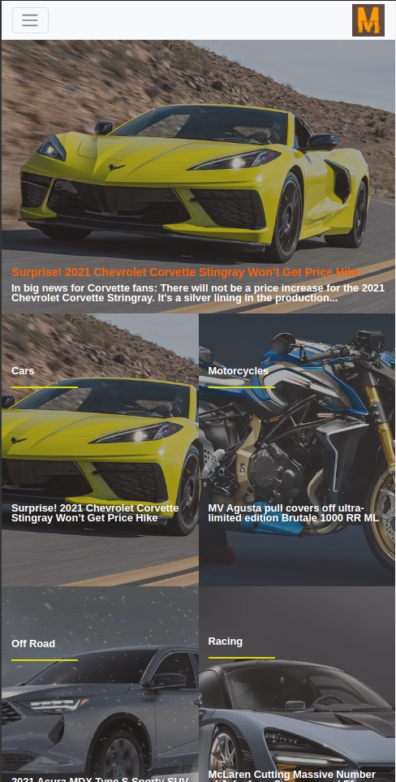
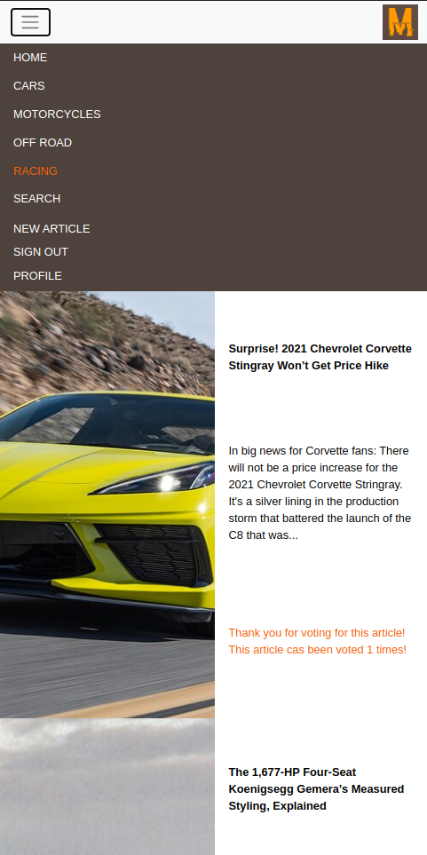
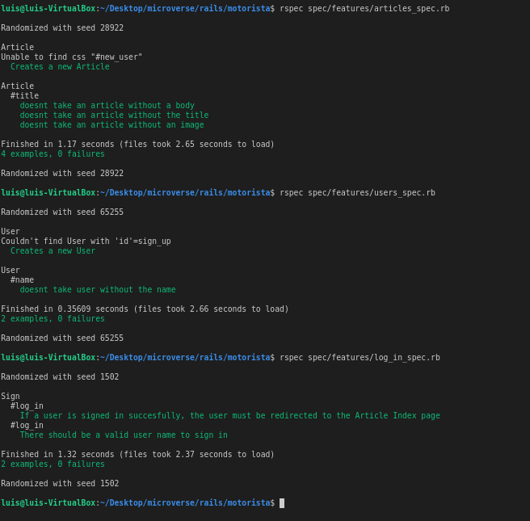

# Motorista

[![Contributors][contributors-shield]][contributors-url]
[![Forks][forks-shield]][forks-url]
[![Stargazers][stars-shield]][stars-url]
[![Issues][issues-shield]][issues-url]

> Motorista is an online magazine for the petrolheads, designed to host articles from all around the automotive and motorcycle world. The categories currently implemented are Cars, Motorcycles, Off-Road, and Racing. The features of this website are user creation/log-in, user profile with the most voted article featured at the top, and a list of the latest articles written by the author. For the articles section, we have the creation of new articles, a show page for each one of them featuring the article picture, title, and content. The home page is a webpage that displays the featured article at the top (Most voted) and a list of categories featuring the most recent article added to that section as cover. Signed-in users can upvote their favorite article to see it featured on the home page. The website is fully responsive, with an interactive sliding menu bar. The last feature I will mention here is the search option. You can search for a word or phrase and the related articles will be displayed. For a full experience on the web app, please make sure to visit its [Live Version right here!](https://afternoon-dawn-70531.herokuapp.com/articles)









> This project was a very comprehensive project that included all of the knowledge acquired during the last courses including HTML, CSS, Ruby, and Ruby on Rails. For this project, I also used Bootstrap and SASS for responsive development. It demanded a lot of skill and analysis to be able to implement the design and the project specifications into a fully functioning app.

## Live Version

[Live Version](https://afternoon-dawn-70531.herokuapp.com/articles)

## Video presentation

[Project Video Presentation](https://www.loom.com/share/1d69732a5fda4577a919fd4e1fc0ac88)

## Built With

- Ruby v2.6.5
- Ruby on Rails v6.0.3.1

## Getting Started

To get started with the app, cd to the directory where you would like the repo to live by typing on your terminal:

```
$ cd <directory>
```

Clone the repo typing:

```
$ git clone git@github.com:lmaldonadoch/motorista.git
```

Install the needed gems:

```
$ bundle install
```

Now, set up the database:

```
$ rake db:setup

```

Next, migrate the database:

```
$ rails db:migrate
```

Finally, start server:

```
$ rails server
```

Open `http://localhost:3000/` in your browser.

### Prerequisites

Ruby: 2.6.3
Rails: 5.2.3
Postgres: >=9.5

### Run tests

```
  rspec spec/features/users_spec.rb

  rspec spec/features/log_in_spec.rb

  rspec spec/features/articles_spec.rb
```

This should be the results



## Authors

👤 **Luis Angel Maldonado**

- Github: [@lmaldonadoch](https://github.com/lmaldonadoch)
- Twitter: [@LuisAngelMCh](https://twitter.com/LuisAngelMCh)
- Linkedin: [linkedin](https://www.linkedin.com/in/lmaldonadoch)

## 🤝 Contributing

Contributions, issues and feature requests are welcome!

Feel free to check the [issues page](https://github.com/lmaldonadoch/motorista/issues).

## Show your support

Give a ⭐️ if you like this project!

## Acknowledgments

- Project requested by [Microverse Program](https://www.microverse.org/).
- The project design and original idea are from [Nelson Sakwa](https://www.behance.net/sakwadesignstudio). Big cheers to him! You can find the complete project on [this Behance link](https://www.behance.net/gallery/14554909/liFEsTlye-Mobile-version).
- All the articles were taken from [MotorTrend](https://www.motortrend.com/) and from [MotorCycleNews](https://www.motorcyclenews.com/). Big cheers to the amazing authors and photographers.

<!-- MARKDOWN LINKS & IMAGES -->

[contributors-shield]: https://img.shields.io/github/contributors/lmaldonadoch/motorista.svg?style=flat-square
[contributors-url]: https://github.com/lmaldonadoch/motorista/graphs/contributors
[forks-shield]: https://img.shields.io/github/forks/lmaldonadoch/motorista.svg?style=flat-square
[forks-url]: https://github.com/lmaldonadoch/motorista/network/members
[stars-shield]: https://img.shields.io/github/stars/lmaldonadoch/motorista.svg?style=flat-square
[stars-url]: https://github.com/lmaldonadoch/motorista/stargazers
[issues-shield]: https://img.shields.io/github/issues/lmaldonadoch/motorista.svg?style=flat-square
[issues-url]: https://github.com/lmaldonadoch/motorista/issues
